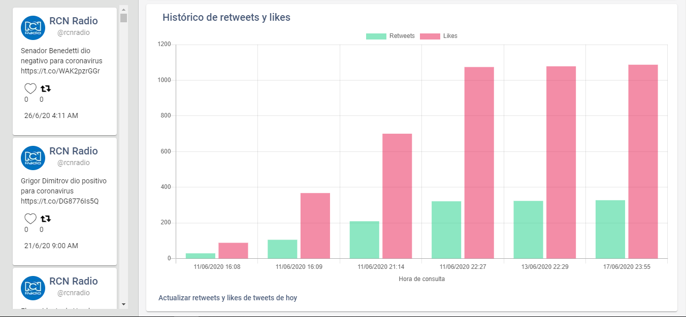
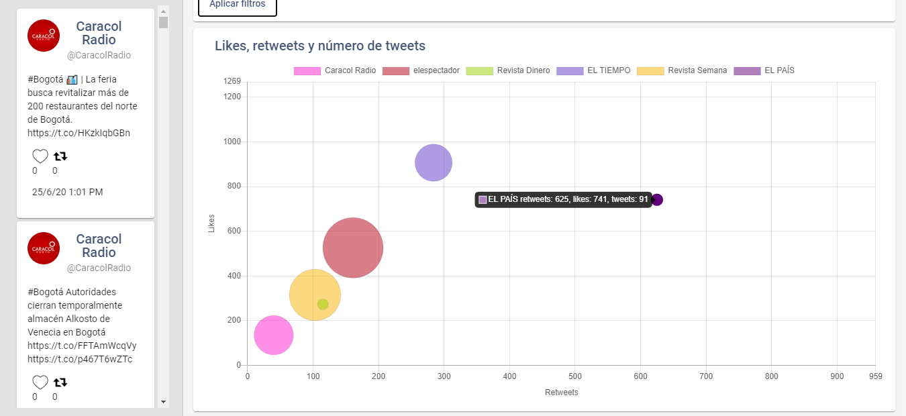
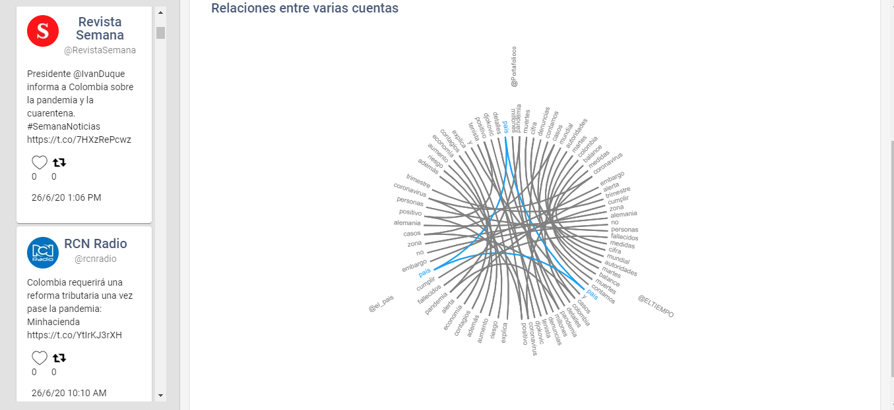
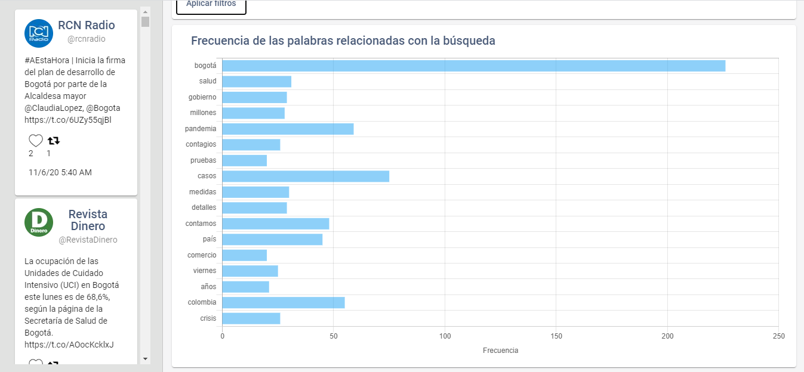

# Cóndor

Cóndor es una aplicación para apoyar el análisis de entorno comunicacional en twitter a través de gráficas que muestran, según parámetros de búsqueda:

el histórico de retweets y likes de tweets a lo largo del tiempo, los retweets, likes y número de tweets por cuenta, las palabras en común entre varias cuentas y las palabras más frecuentes. Además, clasifica automáticamente los sentimientos de los tweets como positivos, negativos, neutros o ninguno.

La aplicación tiene tres elementos que pueden ejecutarse en la misma máquina o en máquinas separadas: Una aplicación web en Angular, un servidor de aplicación en Flask y una base de datos en MongoDB. La aplicación se puede utilizar desde la misma máquina donde se ejecuta la aplicación web o a través de cualquier equipo que se pueda conectar a esta, a través de cualquier navegador web.

## Instrucciones de instalación y configuración inicial
**Importante: Para usar Cóndor, es necesario tener una aplicación de [Twitter Developers](https://developer.twitter.com/en). Si no se tiene una, debe ser creada. Puede que la aprobación de la app por parte de Twitter tarde horas o incluso días.**

La versión de Cóndor que está en este repositorio está configurada para ejecutartodos los componentes en la misma máquina. Si se quiere ejecutar algunos en máquinas separadas, se deben reemplazar las direcciones IP que están en el código de `frontend` y `backend` como se explica más adelante.

### MongoDB
1. En la máquina donde se van a almacenar los datos, instalar [MongoDB](https://www.mongodb.com/try/download/community)
2. En MongoDB, crear un usuario mongodb_username_here, habilitar la autenticación y, si es necesario, crear un usuario adicional que tenga permisos de lectura y escritura en la base de datos del proyecto (que se creará en el siguiente paso). Para esto, seguir las instrucciones que se encuentran en [este enlace](https://docs.mongodb.com/manual/tutorial/enable-authentication/) 
3. Desde la consola de comandos, ejecutar `mongo` para entrar a la linea de comandos de MongoDB. Ingresar el comando `use [nombre_base_de_datos]` (por ejemplo `use condor`)para crear una base de datos para la aplicación.

### Python
1. En la máquina donde se va a ejecutar el servidor web, instalar [Python 3](https://www.python.org/downloads/)
2. Desde la consola de comandos, entrar al directorio `backend` y ejecutar el comando `python -m pip install -r requirements.txt`
3. Abrir el archivo `backend/extract_tweets.py` en un editor y asignar las variables `apiKey`, `apiSecret`, `accessTokenKey` y `accessTokenSecret` a sus valores correspondientes que se pueden consultar en la plataforma de Twitter Developers
4. Abrir el archivo `backend/db.py` en un editor y asignar las variables `username` y `mongodb_password_here` al usuario de MongoDB que se creó anteriormente y su contraseña. Asignar también el valor entre corchetes de la variable `db` al nombre de la base de datos en caso de que sea distinto de "condor"
5. Opcionalmente, si la base de datos se va a ejecutar en una máquina o puerto distinto al 27017 que está configurado por defecto, abrir el archivo `backend/db.py` en un editor y cambiar **solamente** la dirección IP de la variable `client` por la deseada

### Node.js
1. En la máquina donde se va a ejecutar la aplicación web, instalar [Node.js](https://nodejs.org/es/download/)
2. Desde la consola de comandos, entrar al directorio `frontend` del proyecto y ejecutar el comando `npm install` para instalar las dependencias del frontend.
3. Opcionalmente, si el backend se va a ejecutar en una máquina o puerto distinto al 9090 que está configurado por defecto, abrir el archivo `frontend/src/app/api.service.ts` en un editor y asignar el valor de la variable `apiUrl` al valor deseado. **Importante: La variable debe empezar por http://**

## Instrucciones de ejecución
1. Ejecutar la base de datos escribiendo `mongod` en la consola de la máquina donde se encuentra instalado MongoDB
2. Ejecutar el backend entrando al directorio `backend` en la consola de la máquina donde se encuentra instalado Python y ejecutar el comando `python app.py`
3. Ejecutar el frontend entrando al directorio `frontend` en la consola de la máquina donde se encuentra instalado Node.js y ejecutar el comando `ng serve`
Nota: Los tres componentes se tienen que ejecutar en ventanas de consola separadas y estas no se pueden cerrar mientras se quiera seguir ejecutando Cóndor.

## Instrucciones de uso
1. Hacer click en el botón "seguir cuentas" de la parte izquierda de la pantalla. Ingresar los nombres de las cuentas que se quieren seguir. Esto descarga algunos tweets inicialmente y continúa descargando automáticamente los tweets que las cuentas publiquen, siempre y cuando se esté ejecutando la aplicación
2. Se pueden explorar los tweets dando click en el botón de "Ver Tweets" de la parte izquierda de la pantalla
3. Haciendo click en los botones de "Configurar" de las tarjetas del dashboard, se pueden configurar las gráficas. De izquierda a derecha y de arriba hacia abajo, las gráficas muestran:
	- El histórico de retweets y likes de los tweets correspondientes con los filtros. Estos número se actualizan con el botón "Actualizar retweets y likes de hoy" de la parte inferior

	- El número de retweets, likes y número de tweets correspondientes con los filtros

	- Las palabras en común entre varias cuentas en los tweets correspondientes a los filtros

	- Las palabras más frecuentes en los tweets correspondientes con los filtros 

4. El botón "Reiniciar" de cada tarjeta del dashboard reinicia los filtros de la gráfica correspondiente
5. El botón "Visualizar" de la parte izquierda de la ventana de tweets aplica los filtros seleccionados a todas las gráficas
